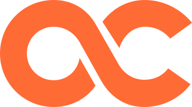
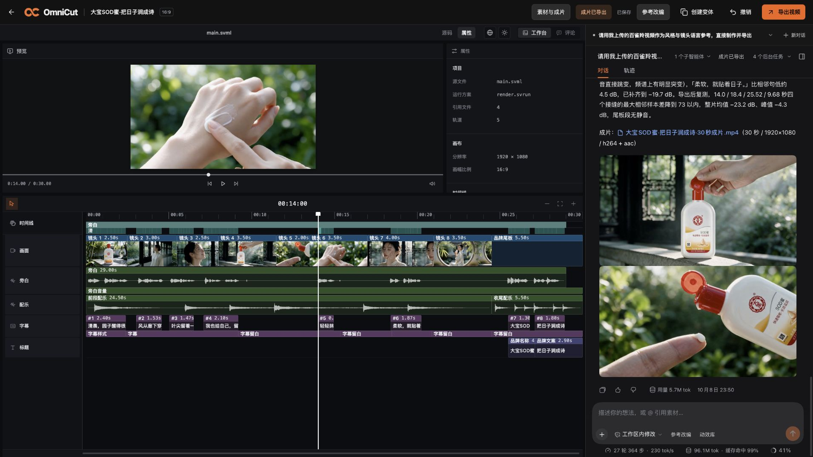
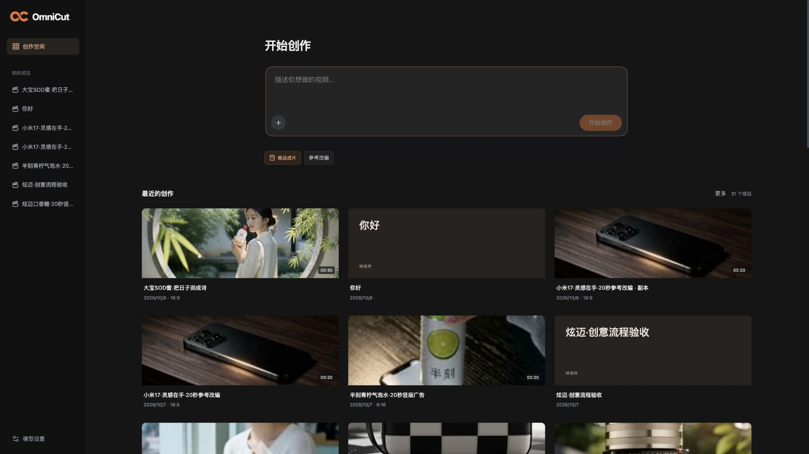

<p align="center"></p>
<h1 align="center">OmniCut</h1>
<p align="center"><strong>让视频 Agent 和你一起把片子改好。</strong></p>
<p align="center">面向商品广告创作的 AI 视频工作台 · 个人产品作品集</p>
<p align="center"><a href="https://shuaweng.github.io/OmniCut/">看产品与样片</a> · <a href="#我希望用户怎么用它">了解使用流程</a> · <a href="docs/本地运行.md">本地运行</a></p>



做一条广告，通常不是说一句「帮我生成视频」就结束了。

你可能想保留刚才那个人物，只换一个场景；觉得旁白太满，让音乐和画面多说两秒；或者已经有一条喜欢的参考片，想借它的节奏，讲自己的商品。

我做 OmniCut，就是想把这些来回修改接起来。**工作台负责精确，对话负责自由。** 人能直接动时间线，Agent 也能在同一份工程里生成素材、写动效、剪辑和导出。做出来以后，还能接着改。

## 先看两条实际做出来的片子

[](https://shuaweng.github.io/OmniCut/#samples)

**[打开样片页，直接播放 →](https://shuaweng.github.io/OmniCut/#samples)**

| 样片 | 创作任务 | 成片 |
| --- | --- | --- |
| [大宝 SOD 蜜](docs/media/dabao.mp4) | 参考一条美妆广告的镜头语言，改成温柔、自然的商品表达 | 30 秒 · 16:9 |
| [雅诗兰黛眼霜](docs/media/estee-lauder.mp4) | 借鉴美妆参考片的氛围，组织人物、眼部细节和产品特写 | 30 秒 · 16:9 |

这些都是实际制作过程导出的样片，保留了效果本身，没有用静态原型代替产品结果。它们是个人概念创作，不是品牌委托、官方广告或真实投放案例；质量也还有提升空间。

## 我希望用户怎么用它

### 1. 有想法就说，有参考就带进来



可以从「做一条 20 秒的手机广告」开始，也可以上传商品图和参考视频，再说清想保留什么、改变什么。

参考改编会先整理画面、时间点与可用的语音信息，再形成脚本和分镜。它要帮助用户借鉴镜头语言，而不是把原片换一个标题就当成新作品。当前理解方式是抽帧与转录，细微动作、音乐情绪和镜头关系仍可能读错。

### 2. 不想一遍遍解释，就让所有人看同一份工程

这是我最在意的产品选择。

生成一张图、手动上传一段视频，或者让 Agent 做一段配音，素材都进入这个项目。用户不需要再点一次「交给助手」，Agent 就能继续引用和剪辑。

工作台里有预览、时间线、字幕、声音和可编辑参数；对话里可以说「第三个镜头短一点」「这句旁白后留半秒」「只重做最后的产品特写」。两种操作写回同一份视频工程，避免聊天说改了、画面却还是旧版。

一个项目也可以开多段对话：一段讨论创意，一段处理配音，另一段专门修尾板。素材与工程共用，聊天上下文分别保存。

### 3. 让模型各做擅长的事

创意导演负责文案、脚本、分镜和针对性的修改建议。主 Agent 负责把方案做出来：调用模型、等待素材、组织工程、检查结果，再继续剪辑。

图片、视频、配音、配乐和音效可以分别选服务。模型生成需要时间，任务会保存进度，完成后让 Agent 接着干；用户可以看到正在发生什么，而不是盯着一段「正在生成」猜它有没有卡住。

代码也是创作工具。Agent 可以编写视频工程与动效组件，把可调参数留在工作台，并将组件保存供其他项目复用。这里复用了上游的创作体系，目前还不是一个成熟的动效模板市场。

### 4. 成片以后，仍然可以继续改

拿到 MP4 是交付的一部分，可编辑工程也会留下。

这意味着换一句文案、重新对齐字幕、调整音乐、替换某个镜头时，能接着当前项目做，尽量保留已经满意的部分。生成素材和剪辑工程分开管理，也让「模型没生成好」与「剪辑没安排好」更容易分辨。

## 亲手做广告后，我改了哪些东西

我用这些真实任务验收产品，才发现「功能接通」和「用户用得顺」差得很远。

| 用起来不舒服的地方 | 产品上的调整 |
| --- | --- |
| 视频还在生成，对话却已经显示「已完成」 | 将媒体等待状态纳入本轮对话，任务没结束就不展示结束操作 |
| 手动生成的素材，助手接不上 | 统一素材和工程上下文，让手动操作与对话协作连续起来 |
| 字幕按预估秒数排，和人声对不上 | 接入真实语音时序与对齐，剪辑时处理停顿与留白 |
| 工具报错和大段日志抢走注意力 | 状态、结果与错误详情分层呈现，让用户先看到该做什么 |
| 每加一个功能，就多一个孤立按钮 | 优先扩展 Agent 工具与共享工程，保留直接操作需要的入口 |

这些调整已经落到代码里，但不代表所有场景都解决了。接下来仍会用完整创作任务，而不是仅靠接口返回成功，判断产品有没有变好。

## 现在做到哪了

这是可以在本地运行的 **Alpha**：创意、参考改编、素材生成、配音配乐、剪辑、字幕和导出已经能串起来，并完成了美妆、快消、消费电子等案例。

还需要继续打磨的，是商品外观与人物跨镜头一致性、声音情绪与画面节奏，以及复杂参考片的拆解。模型和账号权限也会影响结果。目前没有多人账号体系、线上 SaaS 或商业投放效果数据；展示页只展示作品，不提供在线生成。

## 想自己跑起来

准备 Node.js 24+、Git、FFmpeg，然后：

```sh
git clone https://github.com/shuaweng/OmniCut.git
cd OmniCut
npm run setup -- --prepare-browser
npm start
```

打开 [本地工作台](http://localhost:5180)，在「模型设置」中填自己的 API Key。对话与视频内核已随源码内置，安装只需在这一个目录完成。首次安装会下载通用依赖和渲染浏览器；模型服务按你自己的账户计费。

完整依赖、模型配置与常见问题见 **[本地运行指南](docs/本地运行.md)**。当前以 macOS / Linux 为主；安装与运行以仓库内的固定版本为准，其他平台兼容性仍需继续验证。

## 一个仓库，包含完整的产品内核

```text
OmniCut/
├── src/                产品界面
├── server/             项目、素材、模型与任务服务
├── harness/            创作工具、Skills 与聊天扩展
├── engines/agent/      内置对话 / Agent 内核源码与运行包
└── engines/video/      内置编辑、语义时间线与渲染内核
```

用户只需安装和启动 OmniCut，不需要另行安装 DSH、克隆 Hypit，或摆好几个同级目录。两套内核的源码、固定版本和许可都在仓库中，产品直接使用它们；上游包名保留，用于兼容已有工程和扩展。

## 关于实现与开源来源

OmniCut 的工作重点是产品组织、体验与能力融合：项目和多对话、统一素材、媒体任务、模型适配，以及聊天与工作台之间的连接。

- **[Hypit](https://github.com/hypit-ai/hypit)** 提供视频工程、原生 Studio、语义时间线、创作组件与渲染能力。
- **[DeepSeek Harness](https://github.com/deepseek-ai/deepseek-harness)** 提供原生聊天、会话、工具执行、子 Agent、上下文管理及 Skills / MCP 扩展。
- 图标与字体来自 Lucide、Lobe Icons、Noto Sans CJK 和得意黑等项目。

这份作品并不把底层引擎当作全自研。源码公开用于学习与作品集展示，适用条款见 **[LICENSE](LICENSE)** 和 **[第三方来源说明](THIRD_PARTY_NOTICES.md)**；其中保留了 Hypit 的附加许可条件，不是无条件商用许可。
